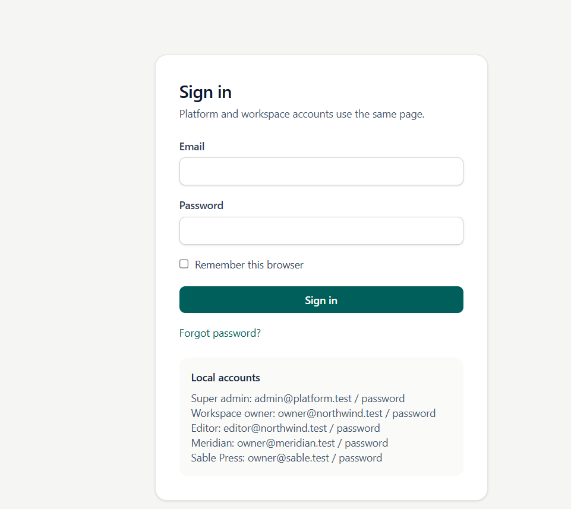
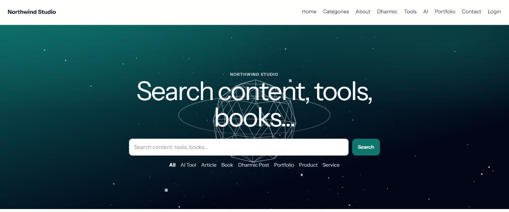
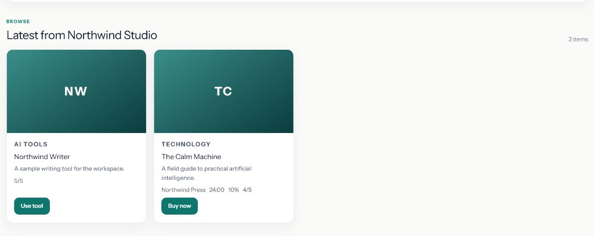

# Content Platform

Multi-tenant Laravel 12 app for configurable public sites. Each workspace owns its content types, categories, menus, theme, SEO, email, feedback, commerce, and backups. Records stay isolated by `tenant_id`.

## Screenshots

### Sign in



Shared login for platform and workspace accounts. Desktop layout: form on the left, Three.js visual panel on the right.

### Public home — hero



Full-width hero with search, type filters, and optional Three.js animation. Mid-page category filter is skipped when search already lives in the hero.

### Public home — product list



Card grid aligned from the left (`auto-fill`), with placeholders, ratings, and action buttons. **Buy now** adds purchasable items to the cart when commerce is enabled.

## Stack

- PHP 8.3 / Laravel 12
- MySQL 8.4, Redis, Nginx
- Vite + Tailwind + Alpine
- Docker Compose

## Quick start

```bash
docker compose up -d --build
docker compose exec app php artisan key:generate
docker compose exec app php artisan migrate --seed
docker compose exec app php artisan permissions:sync
docker compose exec app php artisan content:install
docker compose --profile assets run --rm node
docker compose exec app php artisan storage:link
```

| Service | URL |
| --- | --- |
| App | http://localhost:8080 |
| phpMyAdmin | http://localhost:8081 (`root` / `root`, server `mysql`) |
| MySQL | `localhost:3307` (`blog` / `secret`) |

## Seeded accounts

| Role | Email | Password |
| --- | --- | --- |
| Super admin | `admin@platform.test` | `password` |
| Northwind owner | `owner@northwind.test` | `password` |
| Northwind editor | `editor@northwind.test` | `password` |
| Meridian owner | `owner@meridian.test` | `password` |
| Sable owner | `owner@sable.test` | `password` |

Public **customers** register separately on each site (not the workspace staff accounts above).

## Sample public sites

- http://localhost:8080/site/northwind
- http://localhost:8080/site/meridian
- http://localhost:8080/site/sable

## What is done

### Platform and workspaces

- Shared-schema multi-tenancy (`tenant_id` isolation)
- Platform super-admin area and per-workspace `/app` dashboard
- Modules, roles, permissions (`permissions:sync`)
- Content types, Form Builder, posts, categories, media, pages
- Layout builder, menus, header/footer, theme settings
- SEO, analytics, email templates, feedback, backups
- Showcase tenants (Meridian, Sable) with seeded content and Three.js home hero

### Public storefront and commerce

- Session cart scoped per tenant
- Flow: **Buy now** → cart → checkout → payment → order history
- Customer auth guard (separate from staff): register, login, logout, dashboard, orders
- Example URLs (Northwind):
  - Cart: `/site/northwind/cart`
  - Account: `/site/northwind/account`
  - Register: `/site/northwind/account/register`
- Admin **Commerce** under Backend Settings (`/app/commerce`): enable cart/checkout, currency, gateway (`manual`, `cod`, `razorpay`, `stripe`), API keys, recent orders + status updates
- COD / manual complete as paid; Razorpay / Stripe store keys and use a demo confirm step (no live charge API yet)

### UI polish

- Admin dashboard stats cards and charts
- Login split layout with Three.js on the right panel
- Public home hero search only (no duplicate mid-page filter)
- Product cards left-aligned in a responsive auto-fill grid

## Workspace sidebar

Most links stay flat. Two dropdowns group related tools:

- **Frontend Settings** — Layout, Menus, Header/Footer, Theme
- **Backend Settings** — Users, Roles, Permissions, Commerce, Settings, Backup

Form Builder is a top-level link at `/app/form-builder`.

## Future scope

- Live Razorpay / Stripe charges, webhooks, and refunds
- Coupons, discounts rules, tax, and shipping calculators
- Inventory / stock tracking
- Guest checkout without customer account
- Real multi-currency conversion and localized pricing
- Abandoned-cart recovery and order email notifications
- Customer password reset and profile editing
- Admin order invoice PDF / export
- Wishlist and product reviews tied to commerce

## Environment

Copy `.env.example` to `.env` when needed. Do not commit `.env`.

## Useful commands

```bash
docker compose exec app bash
docker compose exec app php artisan queue:work --sleep=3 --tries=3 --timeout=180
docker compose --profile assets run --rm node
docker compose exec app php artisan test
docker compose exec app php artisan permissions:sync
```

## Docs

See [USER_MANUAL.md](USER_MANUAL.md) for admin workflows.